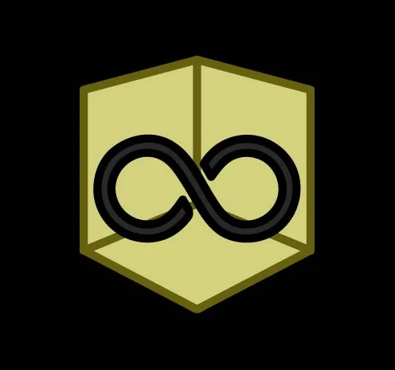

# Backrooms Project

## Overview
The Backrooms is a sentient, biological entity that seeks to expand and absorb mass. It operates on a policy of curiosity, tempting individuals from the Frontrooms into its non-Euclidean environments. This project acts as a centralized wiki and management system for PRA (Project Research & Acquisition) assets and classified expedition logs.

## Features
- **Interactive Wiki:** Navigate through Overview, Mechanics, Levels, and Entity data.
- **PRA Asset Management:** Specialized internal reports on expeditions, including the "Evans Paradox" (File 87-N).
- **Mathematical Mechanics:** Integrated formulas for calculating Sanity Decrease (SD) and tracking absorption risks.
- **Dynamic Theme Engine:** Persistent Light/Dark mode with local storage support.
- **Session Persistence:** Remembers the last viewed tab for researchers in the field.

## Project Structure
- `index.html`: The core wiki structure and content.
- `css/style.css`: Responsive design with cross-platform compatibility (Mobile, Tablet, Desktop, TV).
- `js/script.js`: Logic for navigation, theme toggling, and state persistence.
- `images/`: Directory containing the project logo and PRA assets.

## Installation & Usage
1. Clone the repository or download the source files.
2. Ensure the directory structure is maintained (specifically `/css`, `/js`, and `/images`).
3. Open `index.html` in any modern web browser.

## Technical Notes
The site is optimized for modern browsers (Chrome, Edge, Firefox, Safari) and includes vendor prefixes to support older TV and tablet browsers.